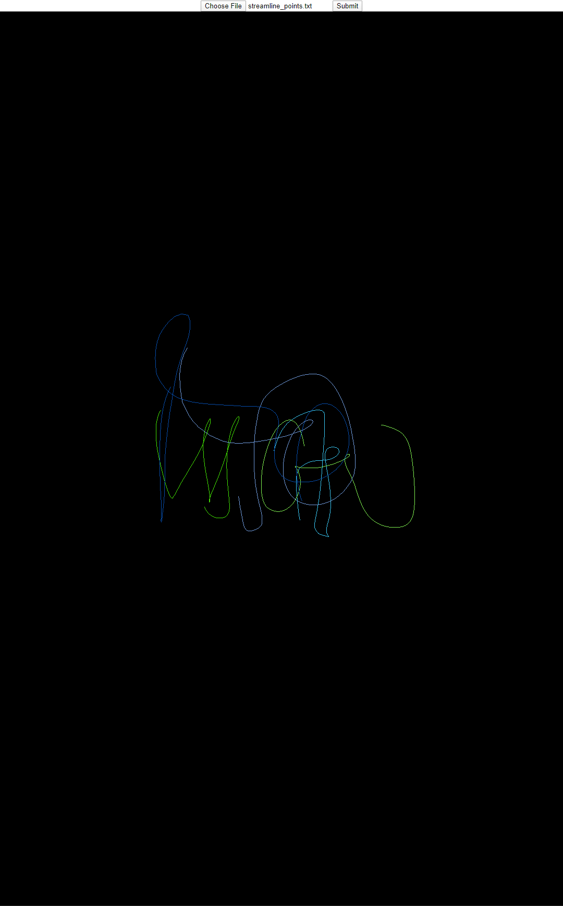
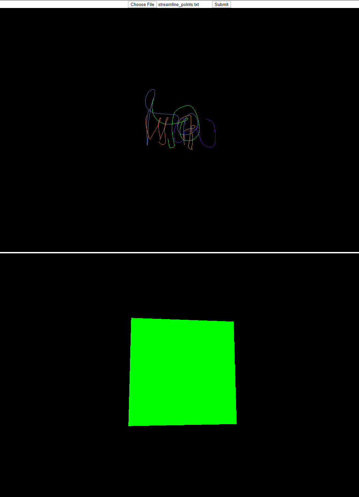
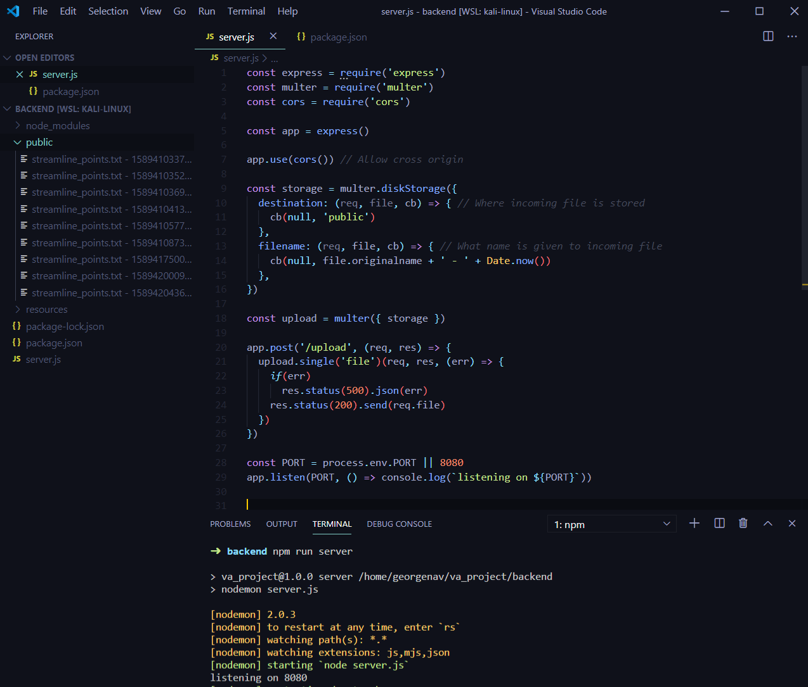

# Vector Analysis Demo

This is an assignment that tests my backend/frontend skills, file managment over http, and understanding of 3D concepts in relation to the library [threejs](https://threejs.org/).

There is a README.md that explains installing dependencies as well as how to run both the frontend and backend in their respective folders.

The resources folder contains the text file used to generate the 3D render and is passed to the backend server on submit.

Programming_Assignment.pdf contains the instructions for this project.

# Results

## 3D result after 'streamline_points.txt' import

## 3D result and threejs square demo result

## Backend storage result

